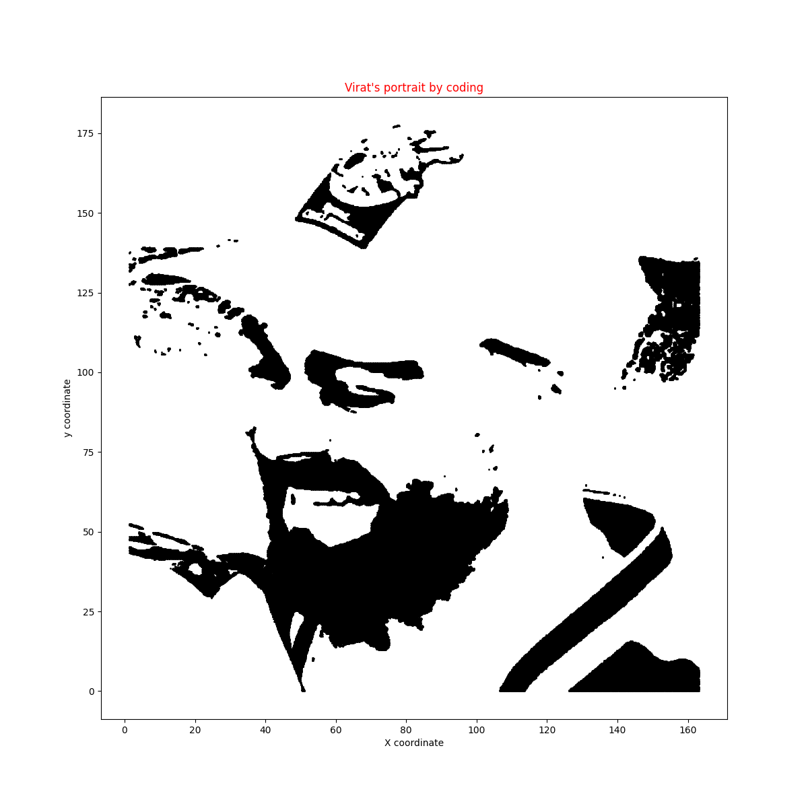

# VK using Numpy, Pandas, Matplotlib
## Output image

# Process
- Taking reference image
- changing image style (recommend: inshot)
- using grid to get coordinates
- creating x and y coordinate
- creating csv to store data
- using scatter plot of matplotlib to create image
# Libraries
- Numpy (to create data)

- Pandas (data handling)

- Matplotlib (visualization)

